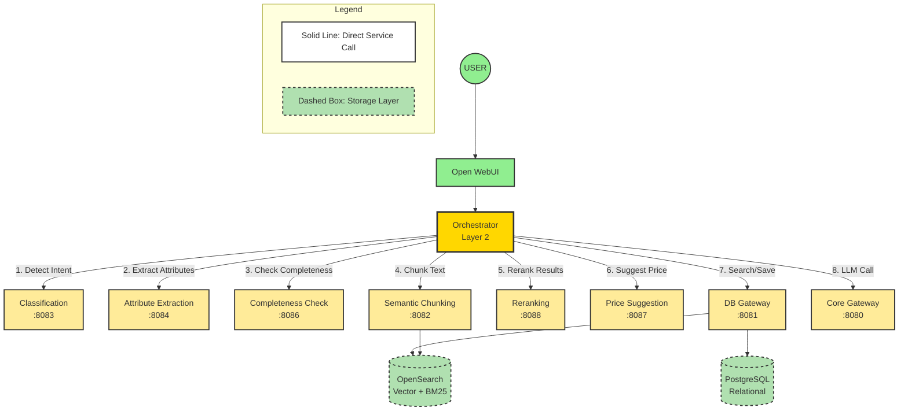
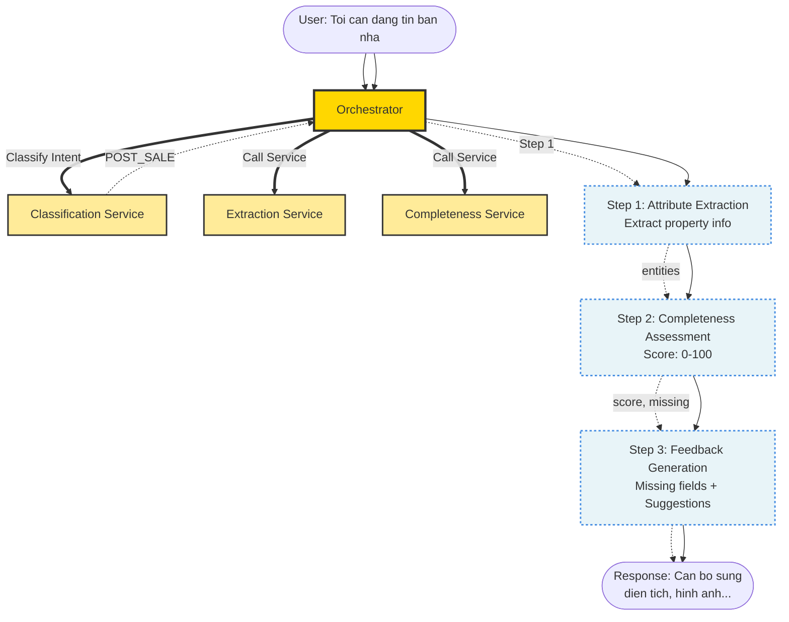
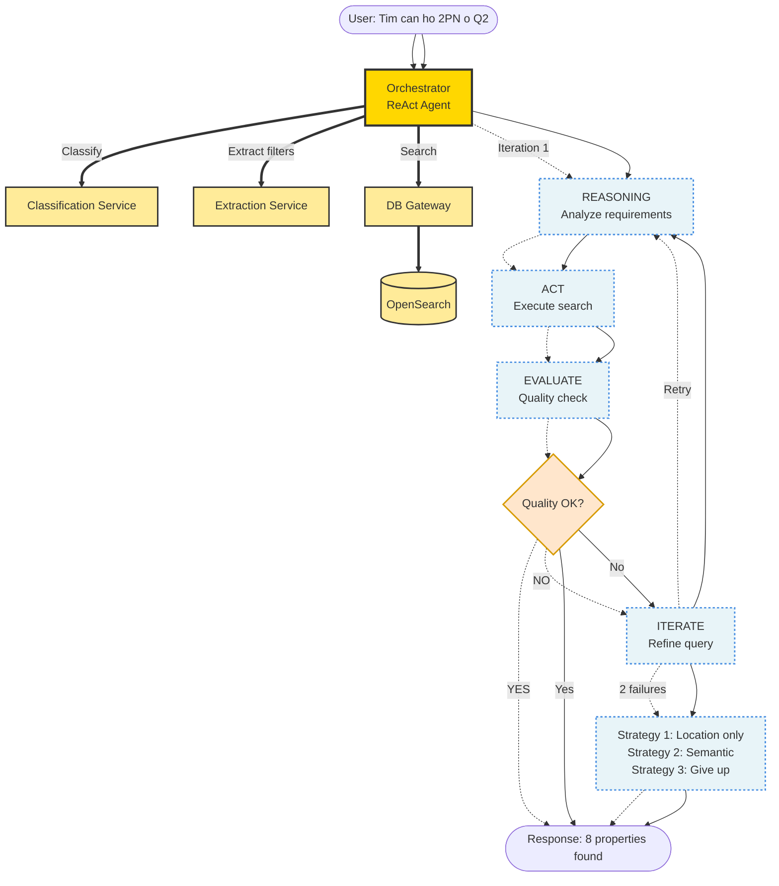
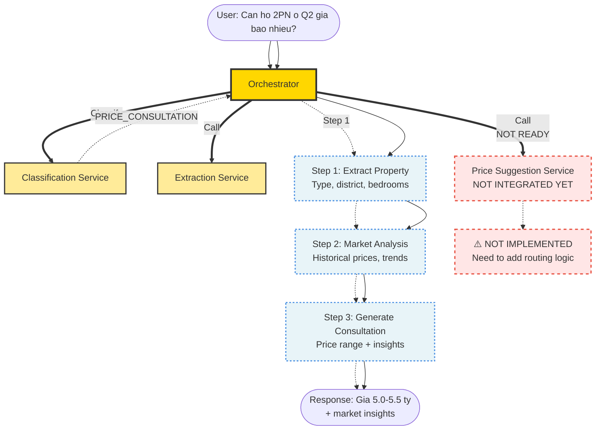
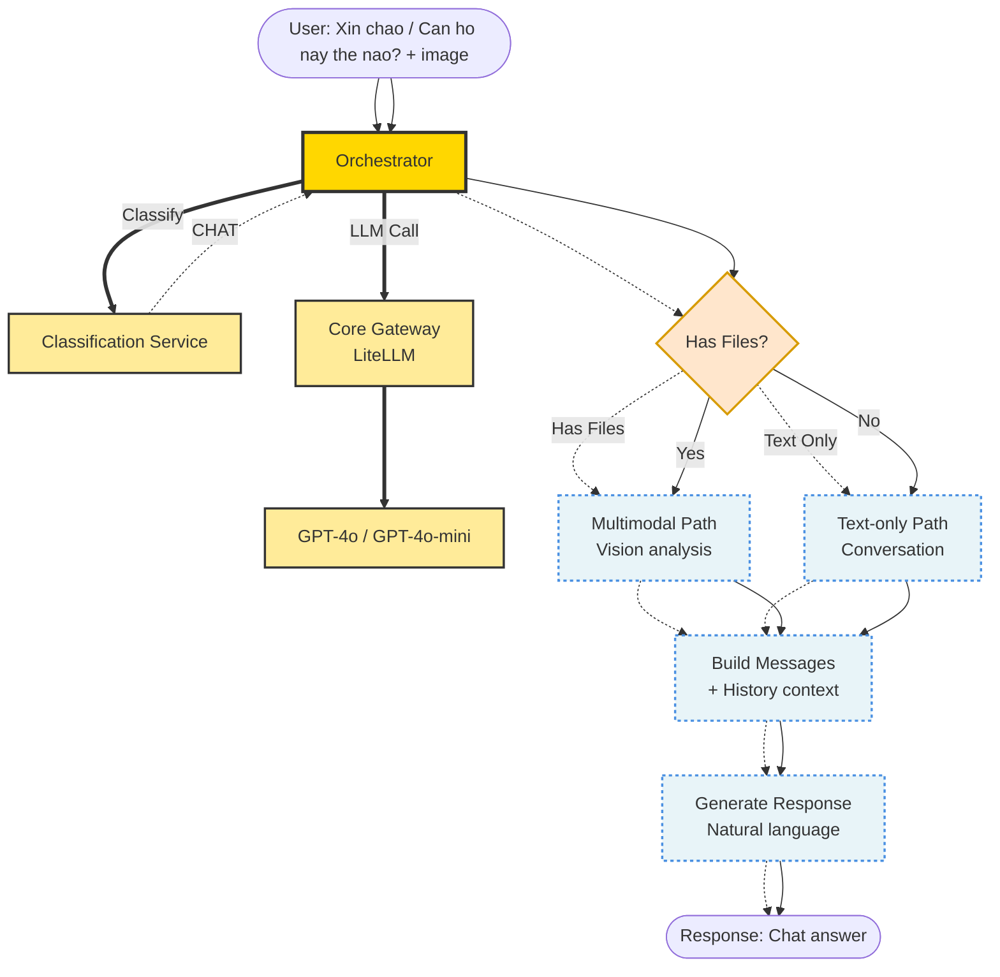
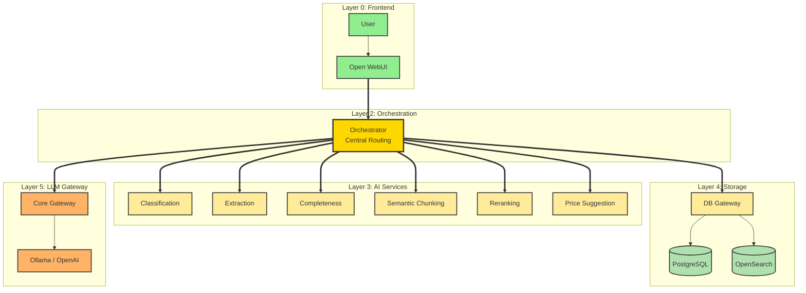

# Orchestrator Architecture Diagram

## High-Level Architecture (CTO Design)

---

## Case 1: Property Posting Flow (POST_SALE / POST_RENT)

**Flow Description:**
1. **Orchestrator calls Classification** → Intent: `POST_SALE`
2. **Internal Step 1** (dashed): Call Extraction Service → Extract attributes
3. **Internal Step 2** (dashed): Call Completeness Service → Score 0-100
4. **Internal Step 3** (dashed): Generate feedback response
5. **Return** to user with completeness feedback

---

## Case 2: Property Search Flow (SEARCH_BUY / SEARCH_RENT)

**Flow Description:**
1. **Orchestrator calls Classification** → Intent: `SEARCH_BUY`, Mode: `filter`
2. **ReAct Loop (dashed vertical)**:
   - **REASONING**: Analyze query requirements
   - **ACT**: Call Extraction + DB Gateway → Search OpenSearch
   - **EVALUATE**: Check result quality (count, relevance)
   - **DECIDE**:
     - If quality OK → Generate response
     - If NOT OK → Refine query (max 2 iterations)
     - If 2 failures → Progressive relaxation strategies
3. **Return** natural language response with properties

---

## Case 3: Price Consultation Flow (PRICE_CONSULTATION) - Proposed

**Status:** ⚠️ **Not implemented yet**

**Proposed Flow:**
1. **Orchestrator calls Classification** → Intent: `PRICE_CONSULTATION`
2. **Internal Step 1** (dashed): Call Extraction Service → Extract property attributes
3. **Internal Step 2** (dashed): Call Price Suggestion Service → Market analysis
4. **Internal Step 3** (dashed): Generate consultation with price range + insights
5. **Return** price consultation response

---

## Case 4: General Chat Flow (CHAT)

**Flow Description:**
1. **Orchestrator calls Classification** → Intent: `CHAT`
2. **Decision**: Has files (images)?
   - **YES** → Multimodal path (vision analysis with GPT-4o)
   - **NO** → Text-only path (conversation with GPT-4o-mini)
3. **Internal Steps** (dashed):
   - Build messages with conversation history
   - Call Core Gateway → LLM
   - Generate natural language response
4. **Return** chat response

---

## Service Communication Matrix

| From | To | Line Type | Purpose |
|------|----|-----------| --------|
| Orchestrator | Classification | **Solid** | Intent detection for all cases |
| Orchestrator | Extraction | **Solid** | Extract attributes (POST, SEARCH, PRICE) |
| Orchestrator | Completeness | **Solid** | Assess listing quality (POST) |
| Orchestrator | DB Gateway | **Solid** | Search/save operations |
| Orchestrator | Core Gateway | **Solid** | LLM calls (CHAT, response generation) |
| Orchestrator | Semantic Chunking | **Solid** | Text preprocessing (if needed) |
| Orchestrator | Reranking | **Solid** | Optimize search results (SEARCH) |
| Orchestrator | Price Suggestion | **Solid** | Price analysis (PRICE - future) |
| **Internal Steps** | **Within Case** | **Dashed** | Processing logic before response |

---

## Layer Architecture Summary

**Key Design Principle (CTO Requirement):**
- ✅ **Only Orchestrator** communicates with Layer 3 services (solid lines)
- ✅ **No cross-service calls** within Layer 3
- ✅ **Internal processing steps** within each case flow use dashed vertical lines
- ✅ **Storage layer** services can communicate with databases (dashed boxes)

---

## Implementation Checklist

### ✅ Currently Implemented
- [x] Case 1: Property Posting (POST_SALE, POST_RENT)
- [x] Case 2: Property Search (SEARCH_BUY, SEARCH_RENT)
- [x] Case 4: General Chat (CHAT)
- [x] Orchestrator → All Layer 3 services (solid lines)
- [x] ReAct Agent pattern with progressive relaxation
- [x] Multimodal support (vision analysis)

### ⚠️ To Be Implemented
- [ ] Case 3: Price Consultation (PRICE_CONSULTATION)
  - [ ] Add intent to Classification Service
  - [ ] Add routing logic in Orchestrator
  - [ ] Create `_handle_price_consultation()` method
  - [ ] Integrate with Price Suggestion Service

---

**Document Version:** 1.0
**Last Updated:** 2025-01-12
**Related Documents:**
- `ORCHESTRATOR_FLOWS.md` - Detailed flow documentation
- `CLAUDE.md` - Project overview
